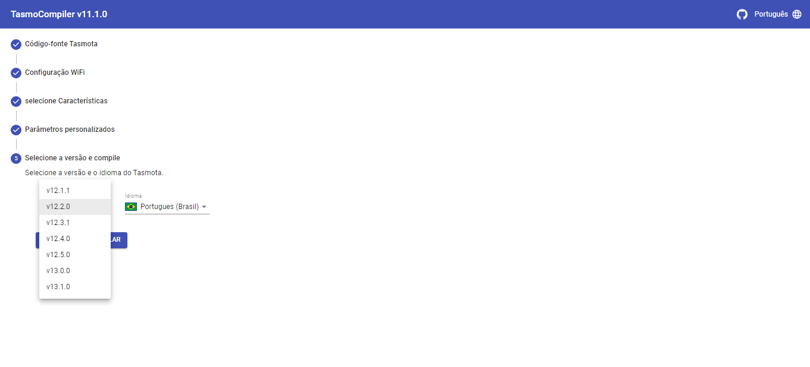

[](https://www.paypal.me/tasmocompiler)
[](https://ko-fi.com/benzino77)


<!--  -->

<div align="center">
  
</div>

#### O que é isso?

TasmoCompiler é uma interface web simples que permite compilar firmware [Tasmota](https://github.com/arendst/Sonoff-Tasmota) fantástico com suas próprias configurações:

- Você pode selecionar para qual placa você está construindo o firmware
- Você pode selecionar quais recursos/sensores do firmware Tasmota deseja usar (a descrição dos recursos disponíveis pode ser encontrada no arquivo [FEATURES DESCRIPTION](https://github.com/benzino77/tasmocompiler/blob/master/FEATURES_DESC.md) file)
- Credenciais para sua rede IOT WiFi, então mesmo após problemas inesperados com o dispositivo (perda total de configuração), as credenciais para sua rede ainda estarão lá, mas principalmente você não precisa se conectar ao AP, servido pela Tasmota para configurar sua casa Wi-fi
- Você pode selecionar a versão do Tasmota que deseja compilar. Você pode selecionar `development`  versão mais recente ou a versão estável mais recente, se esta for a que você gosta
- Idioma da interface GUI do Tasmota
- Você também pode fornecer um firmware personalizado `#defines` se quiser criar um firmware ainda mais adequado às suas necessidades.

#### Por que?

Bem, há duas razões. A primeira é que quero construir meu primeiro aplicativo escrito em NodeJS/React. A segunda é baseada na observação de que toda vez que preparo um novo dispositivo tenho que iniciar o atom com o platformio instalado, configurar tudo  `#defines` (bom, tenho um template que copio) e preparar `platformio.ini`, criar um branch da versão que gosto de usar, etc. ..

Por isso decidi preparar uma solução que seja mais fácil de usar (apenas alguns cliques) e que não exija conhecimento de como instalar o ambiente dev para construir firmware customizado.

#### Como funciona?

A maneira mais fácil é olhar as capturas de tela (todo o processo leva apenas cinco etapas). Após a compilação você poderá baixar quatro (ou três para placas ESP32) arquivos:

1. Seu novo `firmware.bin` arquivo, que pode ser carregado em seu dispositivo via Tasmota WebGUI, espotool, ESPEasy flasher ou qualquer outra ferramenta que você usou para atualizar seu dispositivo
2. Arquivo compactado `firmware.bin.gz` (não disponível para placas ESP32)
3. `platformio_override.ini` arquivo, para verificar quais opções do platformio foram usadas para compilar o arquivo de firmware personalizado
4. `user_config_override.h` arquivo para verificar quais recursos estão incluídos/excluídos do firmware resultante

Os links para baixar esses arquivos aparecerão no campo Progresso da compilação (veja a parte inferior da última captura de tela). Esses links aparecerão somente quando a compilação for bem-sucedida .

Você deve fazer upload apenas `firmware.bin` ou `firmawre.bin.gz` rquivar para o seu dispositivo. Como fazer isso está perfeitamente descrito no [Tasmota wiki](https://github.com/arendst/Sonoff-Tasmota/wiki/Flashing).





#### Como começar a usar o TasmoCompiler?

##### Maneira super fácil (graças a @meingraham e @ Jason2866)

Clique neste [ link para Gipod](https://gitpod.io/#https://github.com/benzino77/tasmocompiler).  Você precisa ter uma conta [Github](https://github.com) e autorizar o Gitpod a acessá-la. Se você não tiver, bastam alguns cliques para criar uma conta no Github. Depois de um tempo, uma nova guia do navegador deve abrir com o TasmoCompiler. Caso tenha pop-up bloqueado em seu navegador você terá que aceitar a nova aba aberta (1 e 2). Se a nova aba não abrir ou você não conseguir ver a notificação pop-up, clique no link Visualização de portas (3) e depois em Abrir navegador (4):


###### Observação

Você deve lembrar que toda a compilação é realizada em servidores Gitpod, então você deve decidir se deseja colocar dados confidenciais, como credenciais Wifi/MQTT, nas mãos do Gitpod :see_no_evil: :hear_no_evil: :speak_no_evil:

##### Jeito fácil

Inicie o TasmoCompiler em docker:

`docker pull benzino77/tasmocompiler`

`docker run --rm --name tasmocompiler -p 3000:3000 benzino77/tasmocompiler`

Em seguida, aponte seu navegador para http://localhost:3000

Se quiser ver mensagens de depuração no console docker, você pode executar um contêiner com a variável env:

`docker run --rm --name tasmocompiler -p 3000:3000 -e DEBUG=server,git,compile benzino77/tasmocompiler`

- `server` para ver mensagens do servidor http
- `git` para ver mensagens de operação git
- `compile` para ver mensagens durante a compilação

Você também pode especificar uma porta diferente na qual o TasmoCompiler estará disponível no host:

`docker run --rm --name tasmocompiler -p 8080:3000 benzino77/tasmocompiler`

Em seguida, aponte seu navegador para http://localhost:8080

##### Maneira menos fácil

1. Install `NodeJS` and `Python 3.6.x` or later
2. Install [`yarn`](https://yarnpkg.com/en/docs/install)
3. Install [`platformio`](https://docs.platformio.org/en/latest/installation.html)
4. Clone/baixe o repositório do github e mude o diretório para o repositório clonado
5. run `yarn install`
6. run `yarn build`
7. run `node server/app.js`
8. aponte seu navegador para http://localhost:3000

#### Como usar "Parâmetros personalizados"?

he configuration options are limited on purpose. I don't want to _overload_ the GUI with too many options. But there is _Custom prameters_ step which allows you to define other Tasmota parameters. Let's say you want to define your MQTT broker and credentials for it. You have to put these lines in _Custom parameters_ field:

```C++
#ifdef MQTT_HOST
  #undef MQTT_HOST
#endif
#define MQTT_HOST               "mqtt.yourhost.iot"

#ifdef MQTT_PORT
  #undef MQTT_PORT
#endif
#define MQTT_PORT               1883

#ifdef MQTT_USER
  #undef MQTT_USER
#endif
#define MQTT_USER            "mqttuser"

#ifdef MQTT_PASS
  #undef MQTT_PASS
#endif
#define MQTT_PASS            "mqttpassword"
```

To define _Friendly name_ for your device you have to put these lines in _Custom parametrs_ field:

```C++
#ifdef FRIENDLY_NAME
  #undef FRIENDLY_NAME
#endif
#define FRIENDLY_NAME          "Watering controller"

```

Let's assume that you want to _compile in_ information about your ntp server, your time zone and location (this is used by timers for events like _sunrise/sunset_). You can do this by putting these lines in _Custom parameters_ field:

```C++
#ifdef NTP_SERVER1
  #undef NTP_SERVER1
#endif
#define NTP_SERVER1             "ntp.yourserver.iot"

#ifdef LATITUDE
  #undef LATITUDE
#endif
#define LATITUDE               34.4348

#ifdef LONGITUDE
  #undef LONGITUDE
#endif
#define LONGITUDE              10.0508

#ifdef APP_TIMEZONE
  #undef APP_TIMEZONE
#endif
#define APP_TIMEZONE           99
```

You can find additional information what can be set by _Custom parameters_ field in [my_user_config.h](https://github.com/arendst/Tasmota/blob/development/tasmota/my_user_config.h) in Tasmota source code.

#### Troubleshooting and advanced usage

If you have problems with the compiler or you are interested in more advance usage, please refer to the [ADVANCED](https://github.com/benzino77/tasmocompiler/blob/master/ADVANCED.md) tips for more information.

#### Development version

There is a TasmoCompiler branch which tries to follow as much as possible changes made to `development` branch of Tasmota. It is bleeding edge version so you can expect unexpected. To use `development` version of TasmoCompiler go to gitpod using this [link](https://gitpod.io/#https://github.com/benzino77/tasmocompiler/tree/development) or pull and run appriopriate docker image:

`docker run --rm --name tasmocompiler -p 3000:3000 benzino77/tasmocompiler:development`

#### Disclaimer

Everything you do, you do on your own responsibility. I do not take any responsibility for damages or problems, that may arise as a result of using this solution or its products.

##### Credits

Thanks to [Theo Arends](https://github.com/arendst) and the entire Tasmota Dev Team for fantastic work!

#### License

TasmoCompiler is licensed under the [MIT license](LICENSE).
